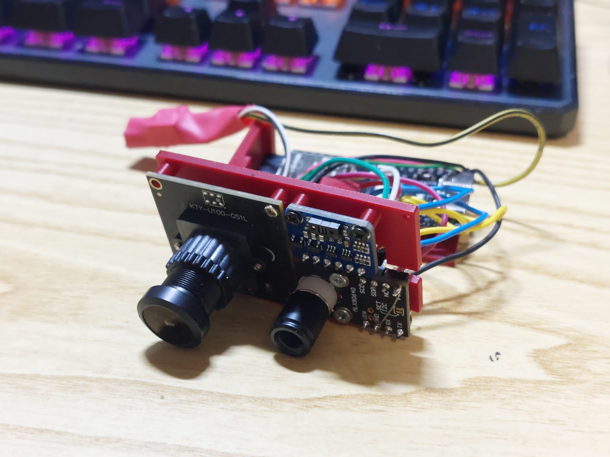

# ESP32-S3 Synchronized Sensor Hub

This repository provides a complete implementation for an **ESP32-S3 Synchronized Sensor Hub**, specifically designed for multimodal data acquisition. The current MCU may be not powerful enought to both acquire data and running a local model.

By fusing high-resolution RGB imagery with the spatial depth data from a Time-of-Flight (ToF) array, this system enables robust depth estimation and object detection even in environments where traditional monocular vision fails.

The thermal camera is there because i just liked the idea to include it.

---

## Introduction

Monocular depth estimation is an **inherently ill-posed problem**. The transformation from a 2D image plane to 3D coordinates—mapping $\mathbb{R}^2 \rightarrow \mathbb{R}^3$—lacks a unique solution without additional geometric priors or contextual assumptions. In real-world applications, image-only methods frequently fail when encountering:
*   **Extreme lighting conditions** (e.g., high dynamic range or low-light).
*   **Motion blur** during high-speed ego-motion.
*   **Textureless surfaces** (e.g., solid white walls, mirrors, or glass).

To resolve these ambiguities, **multi-modal depth estimation** incorporates active sensors like LiDAR or Radar to provide ground-truth metric constraints. However, these sensors are often prohibitively expensive, bulky, and power-intensive, rendering them unsuitable for edge computing or small-scale robotics.

This project bridges the gap by leveraging **Image + Time-of-Flight (ToF) fusion**. By utilizing the **VL53L8CH** multizone sensor, we provide a solution that is:

*   **Cost-Efficient:** Orders of magnitude more affordable than scanning LiDAR systems.
*   **Low-Latency:** Provides real-world metric anchors at high refresh rates for real-time applications.
*   **Compact:** Ideal for ESP32-S3-based embedded systems where form factor and power efficiency are critical.

---

## The VL53L8CH: Beyond Simple Distance

Unlike traditional single-point ToF sensors that provide a single distance value, the **VL53L8CH** is a high-performance, multizone sensor. It functions essentially as a "low-resolution solid-state LiDAR." Key capabilities include:

*   **Spatial Depth Resolution:** It divides the $45^\circ \times 45^\circ$ square field-of-view into a programmable **$4 \times 4$ or $8 \times 8$ grid**, providing up to 64 independent distance measurements simultaneously.
*   **Per-Zone Confidence Metrics:** For every zone, the sensor outputs a **Sigma** estimate (representing the noise/standard deviation) and a **Signal Rate**, allowing inference models to weigh data points based on their reliability.
*   **Ambient Light Immunity:** It reports ambient light levels for each zone, which is critical for correcting depth artifacts in high-exposure outdoor environments.
*   **Target Status Filtering:** The sensor includes an on-board processing chip that assigns a status code (e.g., "Valid," "Signal Blur," "Wrap Around") to each measurement, ensuring only high-quality ground truth enters your inference pipeline.

---

## Hardware Specification

| Component | Part | Interface | Role |
| :--- | :--- | :--- | :--- |
| **MCU** | ESP32-S3 DevKitC-1 | — | Central synchronization & processing |
| **ToF Array** | VL53L8CH (RTrobot) | I2C (0x52) | $8 \times 8$ metric depth map |
| **Thermal Camera**| MLX90640 | I2C (0x33) | $32 \times 24$ thermal distribution |
| **RGB Camera** | USB UVC Module | USB-OTG | High-res visual reference |
| **PC Connection** | — | USB-UART | Data logging & visualization |

---

## Wiring & Interconnectivity

### I2C Shared Bus
*Requires 4.7kΩ pull-up resistors on SDA and SCL to 3.3V.*

| Signal | ESP32-S3 Pin | VL53L8CH | MLX90640 |
| :--- | :--- | :--- | :--- |
| **SDA** | GPIO 8 | SDA | SDA |
| **SCL** | GPIO 9 | SCL | SCL |
| **3V3** | 3.3V | VCC | VCC |
| **GND** | GND | GND | GND |

### Specialized Connections

| Signal | ESP32-S3 Pin | Component | Description |
| :--- | :--- | :--- | :--- |
| **INT** | GPIO 4 | VL53L8CH | Hardware interrupt for sub-ms sync |
| **XSHUT** | GPIO 5 | VL53L8CH | Hardware reset (optional) |
| **D+ (DP)** | USB-OTG D+ | USB Camera | Direct connection |
| **D- (DM)** | USB-OTG D- | USB Camera | Direct connection |

---

## Technical Configuration (Arduino IDE)

To ensure the USB-OTG port is dedicated exclusively to the camera module, use the following board settings:

| Setting | Value |
| :--- | :--- |
| **Board** | ESP32S3 Dev Module |
| **USB CDC On Boot** | **Disabled** |
| **USB Mode** | **USB-OTG** |
| **PSRAM** | OPI PSRAM |
| **Flash Size** | 8MB (or match your board) |
| **Partition Scheme** | Huge APP (3MB No OTA) |

> [!WARNING]
> **"USB CDC On Boot: Disabled"** is critical. If enabled, Serial communication will hijack the OTG port, causing the camera to fail and the system to hang.

---

## Synchronization Strategy

High-fidelity inference requires zero temporal drift between sensors. We implement a **hardware-triggered interrupt strategy**:

1.  **Trigger:** The VL53L8CH is configured to fire a hardware interrupt (**INT**) at **30Hz**.
2.  **Capture:** Upon the interrupt falling edge, the ESP32-S3 immediately captures the current $8 \times 8$ ToF frame and triggers a DMA-transfer for the UVC camera frame.
3.  **Buffer:** The MLX90640 runs asynchronously at **32Hz**. When the ToF interrupt triggers, we pull the most recent thermal frame from the buffer. 
4.  **Result:** Total temporal jitter between sensors is kept **< 1ms**.

---